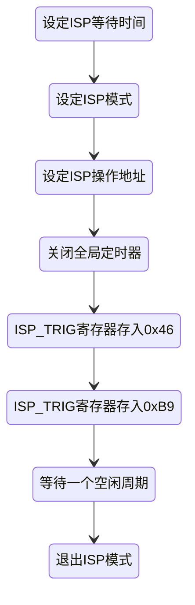

51单片机主要使用的函数
 
<!-- more -->

## 定时器&中断
- 定时器
  - Timer0
  - Timer1
- 定时模式
  - 模式0：13位定时/计数器
  - 模式1：16位定时/计数器
  - 模式2：8位自动重载/定时计数器
  - 模式3：仅限定时器0，Timer0分为两个8位计数器
- 中断
  - 外部中断0，使用中断号0
  - 定时中断0，使用中断号1
  - 外部中断1，使用中断号2
  - 定时中断1，使用中断号3
  - 串口中断

> **计算定时时间公式**

$$
(2^{16}-X)\times \frac{12}{f_n}=Time
$$

> 其中X为定时器初始计数值（填装进Tlx，Thx寄存器）， $f_n$ 为晶振频率


:::code-group
<<< @/code/C/51/51withTimer.c{c}[51单片机定时器及外部中断设计]
:::

## 写内部FLASH

STC89C52/AT89C52内部FLASH扇区地址：

| 第一扇区    | 第二扇区    | 第三扇区    | 第四扇区    |
| ----------- | ----------- | ----------- | ----------- |
| 2000h~21FFh | 2200h~23FFh | 2400h~25FFh | 2600h~27FFh |

| 第五扇区    | 第六扇区    | 第七扇区    | 第八扇区    |
| ----------- | ----------- | ----------- | ----------- |
| 2800h~29FFh | 2A00h~2BFFh | 2C00h~2DFFh | 2E00h~2FFFh |

- 操作模式
  - 0x00: 空闲
  - 0x01: 读出
  - 0x02: 写入
  - 0x03: 擦除
- 操作流程：


<center>


</center>

  - 关闭全局定时器是为了确保连续往ISP_TRIG寄存器存入0x46和0xB9，才能使命令生效
  - 推出ISP模式就是把寄存器ISP_CONTR、ISP_CMD、ISP_TRIG清空

:::code-group
<<< @/code/C/51/InterFLASH.c{c}[内部FLASH读取设计]
:::


## 驱动数码管

数码管有共阴和共阳的类型，引脚分布从左到右一般对应的是从最上面的灯开始，顺时针数再到中间的灯，最后的是右下角的点。转换成程序来中对应的位为hgfedcba，从高到低排列

数码管结构及引脚如下：
```
###     a
# #  f     b
###     g
# #  e     c
### .   d     h
```

因此以共阳极的数码管为例，驱动数字为1时，应往引脚传输的电平为:11111001，对应十六进制为0xF9

:::code-group
<<< @/code/C/51/LEDMatrix.c{c}[数码管驱动]
:::
