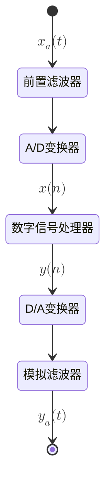

主要记录数字信号处理Matlab代码及相关知识

:::warning

默认已学习完信号与系统

:::
<!-- more -->
# 0.预备知识
## 0.1 数字信号处理的过程

## 0.2 信号的周期

- 离散信号：周期必须为整数，并且当且仅当两个周期信号的周期之比为有理数时，相加之和的信号才为周期信号，此时的和信号周期为它们的最小公倍数
- 连续信号：周期可以是整数、无理数、有理数，且当且仅当两个周期信号的周期之比为有理数时，它们的和信号才是周期信号，且和信号周期为它们的最小公倍数

如 $\sin(n)$，由于$N=\frac{2\pi}{n} \neq R$ 不是周期信号
$\sin(\pi n)$，由于$N=\frac{2\pi}{n\pi}=R$ 是周期信号

## 0.3 偶信号和奇信号

任意信号都可以分解成偶信号和奇信号之和

- 奇信号($Od\{x[n]\}$) $=\frac{1}{2}x[n]-x[-n]$
- 偶信号($Ev\{x[n]\}$) $=\frac{1}{2}x[n]+x[-n]$

## 0.4 序列的基本运算

- 移位  $x(n\pm m)$
- 翻褶  $x(-n)$
- 和  $x(n)+y(n)$
- 积  $x(n)\bullet y(n)$
- 累加  $y(n)=\sum\limits_{k=-\infty}^\infty x(k)$
- 差分运算  $\triangle x(n)=x(n+1)-x(n) \\ \triangle x(n)=x (n)-x(n-1)$ 

## 0.5 序列的能量和功率

- 能量：$E_\infty=\lim\limits_{N \to \infty}\sum\limits_{n = -N}^\infty|x[n]|^2=\sum\limits_{n = -\infty}^\infty|x[n]|^2$
- 功率：$P_\infty=\lim\limits_{N \to \infty}\frac{1}{2N+1}\sum\limits_{n = -N}^\infty|x[n]|^2$

---

- 能量信号：能量有限，功率为0
- 功率信号：功率有限，能量数值无界
- 非功非能信号：不满足上述两个条件的信号

:::warning

因此说一个序列要么是功率信号要么是能量信号是错误的

:::

## 0.6 离散时间(傅里叶变换DTFT)

$X(e^{j\omega})=DTFT[x(n)]=\sum\limits_{n=-\infty}^\infty x(n)e^{-j\omega n}$

即将$z$换成$e^{j\omega}$

:::tip Tips

时域周期->频域离散

时域离散->频域周期

时域非周期->频域连续

时域连续->频域非周期

:::

可以看出 $e^{j\omega n}$ 是以 $2\pi$ 为周期的正交周期函数

反变换：IDTFT

# 1.离散傅里叶变换(DFT)
## 1.1 周期序列的傅里叶级数对——离散傅里叶级数(DFS)

$$

\tilde{X}(k)=\sum\limits_{n=0}^{N-1}\tilde{x}(n)e^{-j\frac{2\pi}{N}nk}

$$

> IDFS:

$$

\tilde{x}(n)=\frac{1}{N}\sum\limits_{k=0}^{N-1}\tilde{X}(k)e^{j\frac{2\pi}{N}nk}

$$

其中  $e^{j\frac{2\pi}{N}nk}$ 称为旋转因子，$\tilde{x}$ 上的波浪线代表其为周期函数

在数字信号处理中一般使用符号 $W_N=e^{j\frac{2\pi}{N}}$，其中N为离散序列的周期
故有：

$$

W_N^k=e^{j\frac{2\pi}{N}k}

$$
$$

W_N^{nk}=e^{j\frac{2\pi}{N}nk}

$$

$$
\cdots
$$

> $W_N$ 的性质：
> - 共轭对称性：$W_N^n=(W_N^{-n})^*$
> > 在复变中，指数型复数取共轭即在 $j$ 前加负号
> - 周期性：$W_N^n=W_N^{n+iN}$
> - 可约性：$W_N^{in}=W_{N/i}^{n}$ , $W_{Ni}^{in}=W_N^n$
> - 正交性：
$$
\frac{1}{N}\sum\limits_{k=0}^{N-1}W_N^{nk}(W_N^{mk})^*=\frac{1}{N}\sum\limits_{k=0}^{N-1}W_N^{(n-m)k}=\begin{cases}
    1\quad n-m=iN\\
    0\quad n-m\neq iN
\end{cases}
$$

## 1.2 DFS与DTFT的关系

$\tilde{X}(k)$ 这一周期序列可以看作是 $\tilde{x}(n)$ 的一个周期 $x(n)$ 的z变换 $X(z)$ 在z平面单位圆上按等间隔角 $\frac{2\pi}{N}$ 抽样得到，或是 $x(n)$ 的傅里叶变换 $X(e^{j\omega})$ 在 $[0,2\pi)$ 上的N点等间隔采样，抽样间隔为 $\frac{2\pi}{N}$

$$

\tilde{X}(k)=X(z)|_{z=e^{j\frac{2\pi}{N}k}}

$$

$$

\tilde{X}(k)=X(e^{j\omega})|_{\omega=\frac{2\pi}{N}k}

$$

省流就是在z平面或者在频谱上进行抽样

e.g：计算 1 1 1 1 1 的5点DFS：

$$ 
\tilde{X}(k) = \sum_{n=0}^{N-1} \tilde{x}(n) e^{-j \frac{2\pi}{N} nk} 
$$
$$ 
\tilde{X}(0) = \sum_{n=0}^{4} \tilde{x}(n) e^{-j \frac{2\pi}{5} n \cdot 0} = \sum_{n=0}^{4} 1 \cdot 1 = 5 
$$

$$
 \tilde{X}(1) = \sum_{n=0}^{4} \tilde{x}(n) e^{-j \frac{2\pi}{5} n \cdot 1} = \sum_{n=0}^{4} e^{-j \frac{2\pi}{5} n}
$$

$$
 \tilde{X}(1) = 1 + e^{-j \frac{2\pi}{5}} + e^{-j \frac{4\pi}{5}} + e^{-j \frac{6\pi}{5}} + e^{-j \frac{8\pi}{5}} = 0 
$$
（等比数列的求和公式）

$$
 \tilde{X}(2)=\cdots \\
 \tilde{X}(3)=\cdots \\
 \cdots
$$

最后可得结果：5 0 0 0 0

## 1.3 离散傅里叶变换DFT

