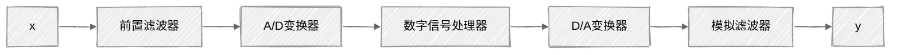

主要记录数字信号处理Matlab代码及相关知识

<!-- more -->
# 0.预备知识
## 0.1 数字信号处理的过程

```mermaid
---
config:
  look: handDrawn
  theme: neutral
---
flowchart LR
  A[x] --> B[前置滤波器]
  B --> C[A/D变换器]
  C --> D[数字信号处理器]
  D --> E[D/A变换器]
  E --> F[模拟滤波器]
  F --> G[y]

```
